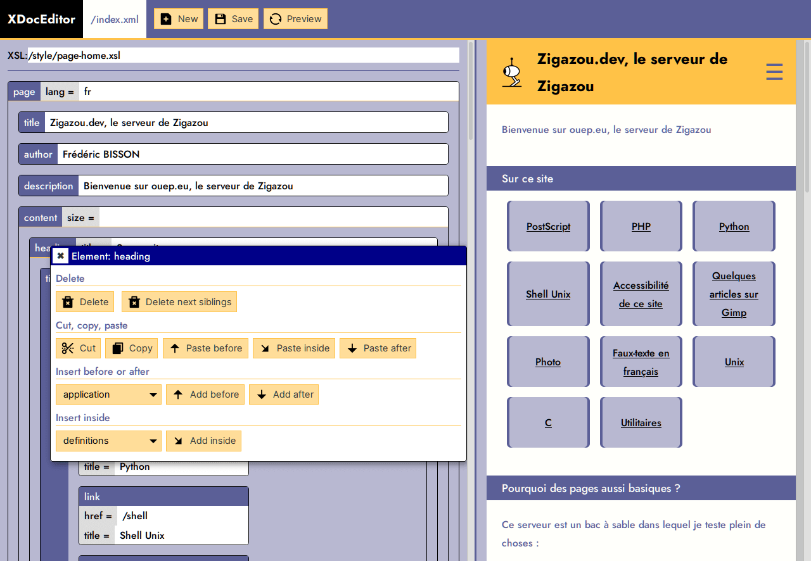

XDocEditor
==========

XDocEditor is an XML editor acting as a front CMS.

It is mainly a POC to demonstrate how to create a CMS working client side with no server side language (like PHP, Python…).

Its characteristics :

- written in JavaScript ES6
    - FetchApi and promises
    - modules
    - ShadowDom
    - VanillaJS
- works with strong CSP rules
    - ShadowDom is used instead of iframe for previews
- uses odd technology for today’s website
    - pages contained in XML files
    - client side rendering with XSL stylesheets
    - pages are saved using HTTP PUT methods

Screenshot
==========

How to use it
=============

See [xdoceditor.html](xdoceditor.html).

The tag-types script tag describes the tags and their relations. Its a
substitute for a real XML Schema.

    

The tag-templates script tag lists templates the user can incorporates into its
document (because opening and closing tags is boring).

    

The [new.xml](new.xml) is a template used when creating a new file.